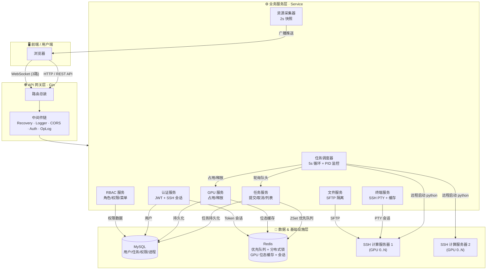

<p align="center">
  
</p>

<p align="center">
  <strong>企业级 GPU 资源管理 & 训练任务调度系统 · 为深度学习而生</strong>
</p>

<p align="center">
  面向 AI / ML 场景的一站式计算平台：SSH 对接计算集群 · 智能排队调度 · Web 终端 · 文件管理 · 实时监控
</p>

<p align="center">
  <a href="https://github.com/your-org/cloudque/actions">
    
  </a>
  <a href="https://go.dev/">
    
  </a>
  <a href="https://github.com/gin-gonic/gin">
    
  </a>
  <a href="https://www.mysql.com/">
    
  </a>
  <a href="https://redis.io/">
    
  </a>
  <a href="https://github.com/your-org/cloudque/blob/main/LICENSE">
    
  </a>
</p>

<p align="center">
  <a href="https://github.com/your-org/cloudque/stargazers">
    
  </a>
  <a href="https://github.com/your-org/cloudque/network/members">
    
  </a>
  <a href="https://github.com/your-org/cloudque/issues">
    
  </a>
</p>

---

<br>

## ✨ 为什么选择 CloudQue

> 「让每一张 GPU 都被充分利用，让每一次训练都井然有序」

CloudQue 为团队的 GPU 计算资源提供**可观测、可调度、可管理**的全生命周期能力：

- **告别手动排队**：再也不用 SSH 上去看谁在跑 —— 提交任务自动排队，显卡空闲立即启动
- **环境隔离无忧**：Conda 环境自动切换、CUDA 设备精准绑定、用户目录权限隔离
- **随时接管训练**：浏览器直接 SSH 进服务器，终端输出实时同步，断线重连不丢历史
- **实时资源全景**：CPU / 内存 / GPU / 磁盘 / 进程全链路监控，秒级刷新

<br>


<br>

## 🎯 核心能力

<table align="center">
  <tr>
    <td width="50%" valign="top">
      <h3 align="center">🧠 智能任务调度</h3>
      <ul>
        <li><strong>优先级队列</strong>：Redis ZSet 按用户优先级 + 提交时间排序</li>
        <li><strong>分布式锁</strong>：SETNX + Lua + 看门狗续期，多实例安全并发</li>
        <li><strong>GPU 资源双层管理</strong>：Redis 缓存位态 + MySQL 持久化</li>
        <li><strong>崩溃自动恢复</strong>：重启扫描 Running 任务 + PID 核实重新接管</li>
        <li><strong>僵尸进程审计</strong>：60 分钟全量同步清理异常任务</li>
        <li><strong>5s 调度循环 · 2s 进程监控</strong>，毫秒级响应</li>
      </ul>
    </td>
    <td width="50%" valign="top">
      <h3 align="center">💻 Web SSH 终端</h3>
      <ul>
        <li><strong>浏览器内即用</strong>：无需本地 SSH 客户端，点击即连</li>
        <li><strong>2MB 环形输出缓存</strong>：重连 / 多标签页秒级补发历史</li>
        <li><strong>UTF-8 安全切片</strong>：杜绝多字节字符截断乱码</li>
        <li><strong>会话复用</strong>：同一用户多标签共享 PTY，输出实时同步</li>
        <li><strong>输入缓冲回放</strong>：SSH 建立前的输入自动排队回放</li>
        <li><strong>30 分钟空闲自动关闭</strong>：资源回收不浪费</li>
      </ul>
    </td>
  </tr>
  <tr>
    <td width="50%" valign="top">
      <h3 align="center">📁 SFTP 文件管理</h3>
      <ul>
        <li><strong>上传 / 下载 / 浏览 / 新建 / 删除 / 重命名</strong> 全套操作</li>
        <li><strong>用户空间隔离</strong>：普通用户限制在 <code>~/home</code> 内</li>
        <li><strong>会话检查缓存</strong>：3s 内免重复 <code>echo 1</code> 探测</li>
        <li><strong>断线自动重连</strong>：透明恢复不中断业务</li>
        <li><strong>磁盘用量定时采集</strong>：空间水位可视化</li>
      </ul>
    </td>
    <td width="50%" valign="top">
      <h3 align="center">📡 实时 WebSocket 推送</h3>
      <ul>
        <li><strong>三路实时通道</strong>：终端输出流 / 系统监控 / 首页概览</li>
        <li><strong>Ping/Pong 心跳</strong>：54s 发 Ping，60s 超时主动断开</li>
        <li><strong>连接池分组</strong>：用户级、管理员级、按会话类型分发</li>
        <li><strong>双协程守护</strong>：ReadPump + WritePump 独立协程</li>
        <li><strong>1024 条发送缓冲</strong>：溢出降级丢弃不致连接崩溃</li>
      </ul>
    </td>
  </tr>
  <tr>
    <td width="50%" valign="top">
      <h3 align="center">🔐 RBAC 权限体系</h3>
      <ul>
        <li><strong>4 层模型</strong>：用户 ⇄ 角色 ⇄ 权限(API) + 菜单</li>
        <li><strong>细粒度接口级控制</strong>：API 维度 + 菜单维度双保险</li>
        <li><strong>操作日志自动记录</strong>：异步批量写入不阻塞请求</li>
        <li><strong>JWT + bcrypt + 图形验证码</strong> 三层认证安全</li>
      </ul>
    </td>
    <td width="50%" valign="top">
      <h3 align="center">⚡ 高可用工程</h3>
      <ul>
        <li><strong>10 步优雅关闭</strong>：按 WS→终端→调度→HTTP→SSH→DB 有序退出</li>
        <li><strong>应用启动器模式</strong>：main 仅 20 行，生命周期统一管控</li>
        <li><strong>依赖注入 + 接口隔离</strong>：全程面向接口，Mock 测试零成本</li>
        <li><strong>Zap 结构化日志 + Lumberjack 轮转</strong>，100MB/3 文件自动压缩</li>
        <li><strong>错误节流器</strong>：防止高频错误日志刷屏</li>
      </ul>
    </td>
  </tr>
</table>

<br>

## 🏗️ 系统架构



<br>

## 🚀 快速开始

### 3 步启动你的 GPU 调度平台

<details open>
<summary><strong>① 准备环境</strong></summary>
<br>

确保你已安装：
- **Go 1.24+**
- **MySQL 8.0+**
- **Redis 6.0+**
- **一台可 SSH 的 Linux GPU 服务器**（作为实际计算节点）

```bash
# 克隆项目
git clone https://github.com/your-org/cloudque.git
cd cloudque

# 安装依赖
go mod tidy
```

</details>

<details open>
<summary><strong>② 配置文件</strong></summary>
<br>

```bash
cp configs/config.yaml.example configs/config.yaml
```

编辑 `configs/config.yaml`，填入 4 类关键信息：
```yaml
database:
  mysql: { host: "your-host", port: 3306, username: "root", password: "***", database: "cloudque" }
  redis: { host: "your-host", port: 6379, password: "***", db: 5 }

jwt:
  secret: "PLEASE-CHANGE-THIS-IN-PRODUCTION-🔥"

server:
  host: "gpu-node-01:22"
  root_username: "root"
  private_key_path: "/root/.ssh/id_rsa"
  base_path: "/home"
  enabled: true
```

初始化数据库：
```bash
mysql -u root -p < scripts/cloudque.sql
```

</details>

<details open>
<summary><strong>③ 启动服务</strong></summary>
<br>

```bash
# 直接跑
go run cmd/server/main.go

# 或者用 Makefile
make run

# 或者编译
make build && ./bin/cloudque-api.exe
```

✅ 默认端口 **8080**，访问健康检查：
```
GET http://localhost:8080/api/v1/health
→ { "status": "ok", "message": "CloudQue API is running" }
```

</details>

<br>

## 🛠️ 技术栈


| 层级 | 技术选型 |
|------|---------|
| **语言** | Go 1.24 |
| **Web 框架** | Gin v1.11 |
| **ORM** | GORM v1.31 |
| **数据库** | MySQL 8.0 |
| **缓存/队列/锁** | Redis (go-redis/v9) |
| **认证** | JWT v5 + bcrypt + base64Captcha |
| **WebSocket** | Gorilla WebSocket v1.5 |
| **SSH / SFTP** | 自研 SessionManager + pkg/sftp |
| **系统监控** | gopsutil/v3 |
| **配置** | Viper v1.21 |
| **日志** | Zap + Lumberjack |
| **邮件** | gomail.v2 |
| **测试** | testify v1.11 |

<br>

## 📐 设计亮点

| 设计 | 说明 |
|-----|------|
| **应用启动器** | main 仅 20 行，所有初始化和 10 步优雅关闭集中在 [app.go](internal/app/app.go) |
| **依赖注入** | Repository → Service → Controller 全构造函数注入，完全面向接口编程 |
| **分布式调度锁** | SETNX + Lua 原子释放 + 看门狗 TTL 续期，多实例部署零冲突 |
| **终端环形缓存** | 2MB 输出缓存 + UTF-8 边界切片，断线重连体验丝滑 |
| **崩溃恢复** | 启动时扫描 DB 运行中任务，核实 PID 存活后重新接管监控 |
| **操作日志异步化** | 批量 + 定时器写入 DB，不阻塞主请求链路 |

<br>

## 🤝 贡献指南

欢迎任何形式的贡献！无论是 🐛 Bug 报告、💡 新功能提议，还是 ✍️ 文档完善。

1. **Fork** 本仓库
2. 创建你的特性分支：`git checkout -b feat/awesome-feature`
3. 提交你的变更：`git commit -m 'feat: add awesome feature'`
4. 推送到分支：`git push origin feat/awesome-feature`
5. 提交 **Pull Request** 🎉

> 💡 提交前确保通过：`make fmt && make vet && make test`

<br>

## 📄 许可证

本项目采用 **MIT License** 开源 — 详见 [LICENSE](LICENSE) 文件。

<br>

## 💬 联系 & 支持

如果 CloudQue 对你有帮助，欢迎点个 ⭐ Star 支持一下！

有任何问题或建议：
- 📮 提 [Issue](https://github.com/your-org/cloudque/issues)
- ✉️ 邮箱：`your-email@example.com`
- 💬 加入社群交流

---

<p align="center">
  <strong>Made with ❤️ using Go · Gin · WebSocket · SSH</strong>
  <br>
  <sub>© 2025 CloudQue Team. Let every GPU count.</sub>
</p>

<p align="center">
  <a href="#top">
    
  </a>
</p>
